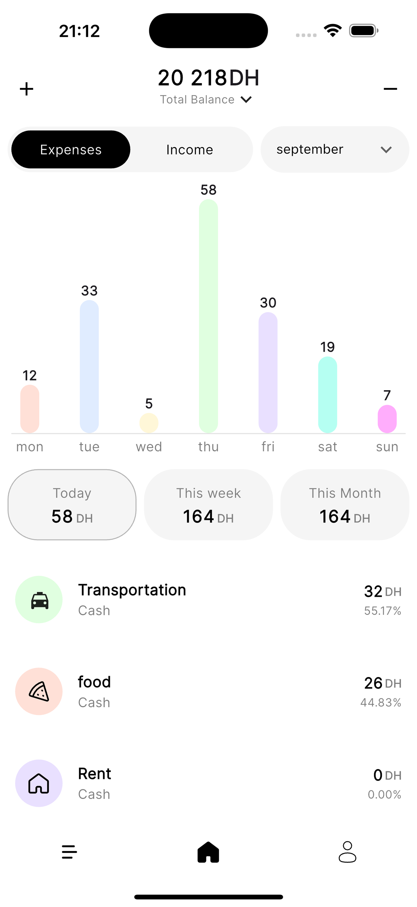
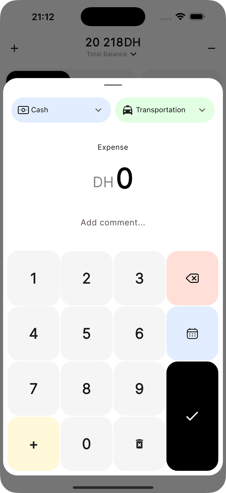

# 💰 Trackparency

<div align="center">
  
  
  **A modern, intuitive expense and income tracking app built with Flutter**
  
  [](https://flutter.dev/)
  [](https://firebase.google.com/)
  [](https://dart.dev/)
</div>

## 📱 Screenshots

<div align="center">
  
  
  
  
  
  *Screenshots showcasing the app's beautiful UI and smooth user experience*
</div>

## 🎥 Demo Video

<div align="center">
  
  **📹 [Watch the Demo Video](https://your-video-link-here.com)**
  
  *Experience Trackparency in action - coming soon!*
  
</div>

## ✨ Features

### 🏠 **Dashboard & Analytics**
- **Real-time Balance Tracking** - Monitor your total balance with live updates
- **Interactive Charts** - Beautiful bar charts showing daily/weekly/monthly spending patterns
- **Smart Summaries** - Today, This Week, and This Month expense/income breakdowns
- **Category Insights** - Top spending categories with percentages and visual indicators

### 💸 **Expense Management**
- **Quick Expense Entry** - Add expenses with custom keyboard and smooth animations
- **Category Selection** - Choose from predefined or custom expense categories
- **Payment Methods** - Track cash, card, and other payment methods
- **Date Selection** - Pick any date with intuitive date picker
- **Comments & Notes** - Add detailed descriptions to your transactions

### 💰 **Income Tracking**
- **Income Categories** - Salary, passive income, side hustle, and more
- **Flexible Input** - Same intuitive interface for income entries
- **Income Analytics** - Track income patterns and sources
- **Balance Updates** - Automatic balance calculations

### 📊 **Transaction Management**
- **Transaction History** - Complete list of all your financial activities
- **Swipe Actions** - Swipe to edit or delete transactions with smooth animations
- **Search & Filter** - Find transactions quickly by date, category, or amount
- **Pull to Refresh** - Real-time data synchronization

### 🎨 **Customization**
- **Category Management** - Add, edit, or remove custom expense categories
- **Personalized Setup** - Choose categories that match your spending habits
- **Beautiful UI** - Modern, clean design with smooth animations
- **Dark/Light Theme** - Adaptive theming for better user experience

### 👤 **Profile & Settings**
- **User Profile** - Manage your account information
- **Category Management** - Customize your expense categories
- **Secure Logout** - Safe account management
- **Onboarding Flow** - Guided setup for new users

## 🛠️ Tech Stack

### **Frontend**
- **Flutter** - Cross-platform mobile development
- **Dart** - Programming language
- **Material Design** - UI/UX framework
- **Google Fonts** - Typography (Inter font family)

### **Backend & Services**
- **Firebase Authentication** - User management and security
- **Cloud Firestore** - Real-time database
- **Firebase UI Auth** - Pre-built authentication components

### **State Management**
- **Provider** - State management solution
- **ChangeNotifier** - Reactive state updates

### **Navigation & Routing**
- **GoRouter** - Declarative routing
- **Navigation Bar** - Bottom navigation with custom icons

### **UI/UX Libraries**
- **Flutter Animate** - Smooth animations and transitions
- **Flutter Slidable** - Swipe-to-action functionality
- **Loading Animation Widget** - Beautiful loading indicators
- **Flutter SVG** - Vector graphics support
- **Animated Digit** - Number animations

### **Utilities**
- **Intl** - Internationalization and date formatting
- **Confirm Dialog** - User confirmation dialogs
- **Flutter Launcher Icons** - App icon generation

## 🚀 Getting Started

### Prerequisites
- Flutter SDK (3.5.3 or higher)
- Dart SDK
- Firebase project setup
- Android Studio / Xcode (for mobile development)

### Installation

1. **Clone the repository**
   ```bash
   git clone https://github.com/yourusername/trackparency.git
   cd trackparency
   ```

2. **Install dependencies**
   ```bash
   flutter pub get
   ```

3. **Firebase Setup**
   - Create a Firebase project
   - Enable Authentication and Firestore
   - Download `google-services.json` (Android) and `GoogleService-Info.plist` (iOS)
   - Place them in the appropriate directories

4. **Run the app**
   ```bash
   flutter run
   ```

## 📱 Platform Support

- ✅ **Android** - Full support with Material Design
- ✅ **iOS** - Native iOS experience with Cupertino elements
- ✅ **Web** - Progressive Web App capabilities
- ✅ **Desktop** - Windows, macOS, and Linux support

## 🎯 Key Features in Detail

### **Custom Keyboard**
- Intuitive number input with mathematical operations
- Visual feedback and smooth animations
- Support for addition operations (e.g., 1000+500)
- Clear and backspace functionality

### **Smart Categories**
- Pre-defined categories: Transportation, Food, Rent, Travel, Health, Home Accessories
- Custom category creation with icons
- Category-based spending analytics
- Visual category indicators with colors

### **Date Management**
- Flexible date picker with month navigation
- Support for past and future dates
- Visual date selection with calendar interface
- Automatic date formatting

### **Transaction Actions**
- Swipe left to reveal edit/delete options
- Smooth slide animations
- Confirmation dialogs for destructive actions
- Real-time UI updates

## 🔒 Security & Privacy

- **Firebase Authentication** - Secure user authentication
- **Data Encryption** - All data encrypted in transit and at rest
- **Privacy First** - No data sharing with third parties
- **Local Storage** - Sensitive data stored securely

## 🤝 Contributing

We welcome contributions! Please see our [Contributing Guidelines](CONTRIBUTING.md) for details.

1. Fork the repository
2. Create your feature branch (`git checkout -b feature/AmazingFeature`)
3. Commit your changes (`git commit -m 'Add some AmazingFeature'`)
4. Push to the branch (`git push origin feature/AmazingFeature`)
5. Open a Pull Request

## 📄 License

This project is licensed under the MIT License - see the [LICENSE](LICENSE) file for details.

## 🙏 Acknowledgments

- Flutter team for the amazing framework
- Firebase for backend services
- All open-source contributors
- Design inspiration from modern fintech apps

## 📞 Support

- 📧 Email: support@trackparency.com
- 🐛 Issues: [GitHub Issues](https://github.com/yourusername/trackparency/issues)
- 💬 Discussions: [GitHub Discussions](https://github.com/yourusername/trackparency/discussions)

---

<div align="center">
  <p>Made with ❤️ By oussama ennadafy using Flutter</p>
  <p>© 2025 Trackparency. All rights reserved.</p>
</div>
